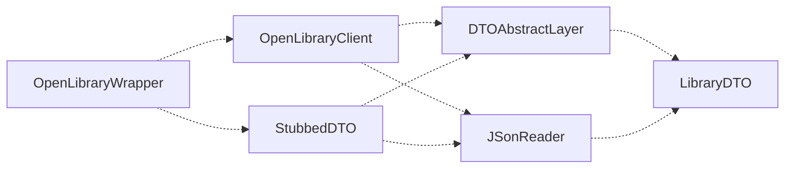
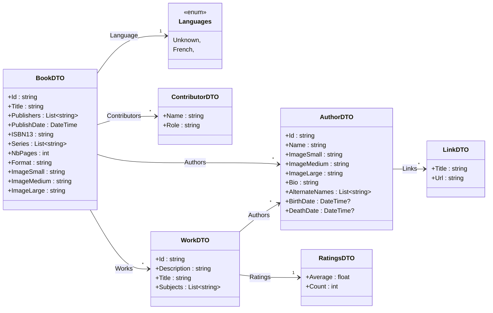
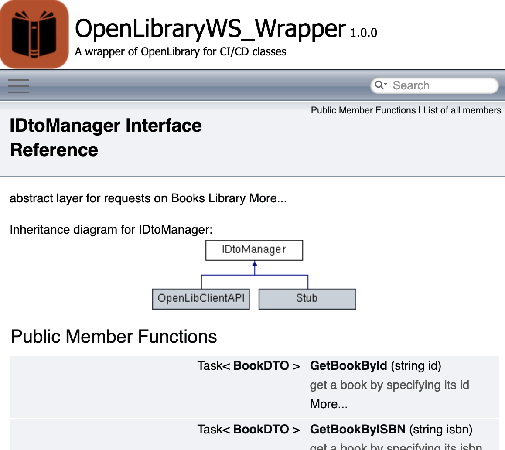
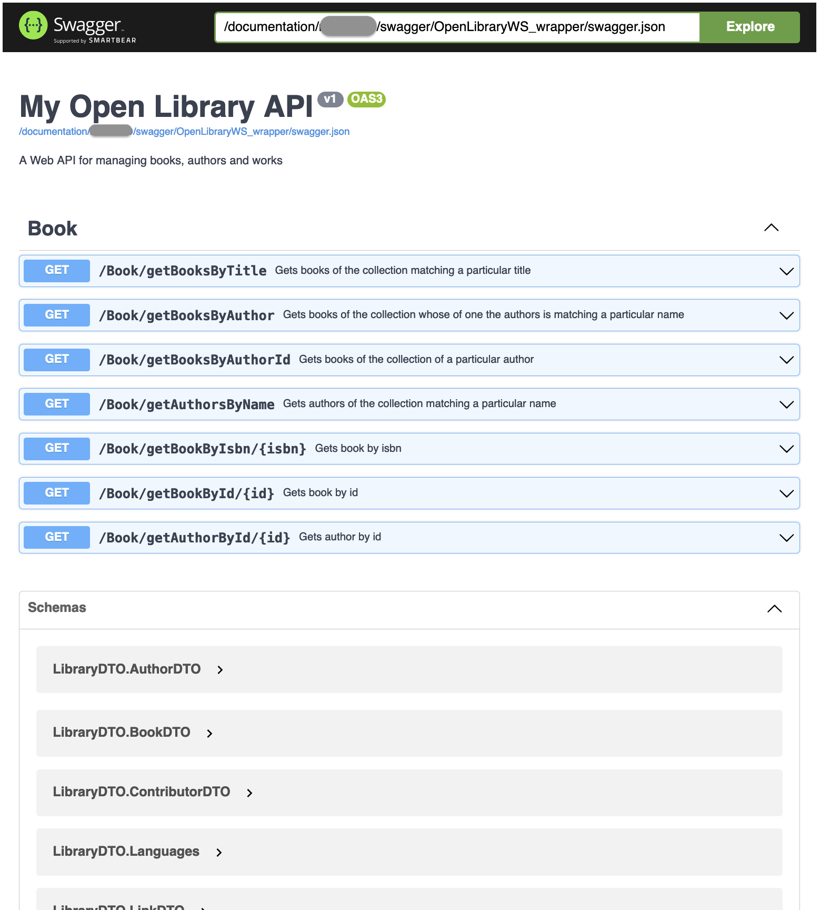

# OpenLibraryWS_wrapper

## Summary

This project proposes a Web Service wrapping the [OpenLibrary](https://openlibrary.org/). This is an archive of books and editions and it proposes a web api. This work here is a wrapper in order to simplify the use of this api, with less routes, and also to be interchangeable with another web service that will be issued shortly, owning its proper database of books.  
Its purpose is mainly and only to be used by my students in order to practice a little bit _continuous integration_ and _continuous deployment_. 

## Table of Contents

[Documentation](#documentation)  
[Getting Started](#getting-started)  
[Where are we now?](#where-are-we-now)  
[Usage](#usage)  
[Running the tests](#running-the-tests)  
[Known issues and limitations](#known-issues-and-limitations)  
[Built with](#built-with)  
[Authors](#authors)  
[Acknowledgements](#acknowledgements)  

## Documentation

There is no other documentation than this ```ReadMe```, at least for now.  
But here are some useful informations.  
### Package diagram

This work contains some projects:
- ```LibraryDTO```: contains all **DTO** (_Data Transfer Object_) used by the web service(s) of this project
- ```DTOAbstractLayer```: defines a unique interface (```IDtoManager```) for all objects that can be used to make requests  
- ```JSonReader```: contains some tools simplifying the parsing of json request results coming from ```OpenLibrary API```
- ```StubbedDTO```: is only used for testing the preceding packages. It contains some json files copied from ```OpenLibrary API``` request results
- ```OpenLibraryClient```: this is the wrapper of ```OpenLibrary API```. It implements ```IDtoManager``` and uses ```OpenLibrary API``` requests to get books and authors.
- ```OpenLibraryWrapper```: defines our Web Service and its routes. 

### Routes of ```OpenLibraryWrapper``` web service:
There are very few routes: 
  - **get books by title**: allows to get books containing a particular string in their titles.
  ```
  book/getbooksbytitle?title=ne&index=0&count=5
  book/getbooksbytitle?title=ne&index=0&count=5&sort=old
  ```
  - **get books by author**: allows to get books containing a particular string in the author names or alternate names.
  ```
  book/getbooksbyauthor?name=al&index=0&count=5
  book/getbooksbyauthor?name=al&index=0&count=5&sort=old
  ```
  - **get books by author id**: allows to get books of a particular author by giving its id.
  ```
  book/getbooksbyauthorid?id=OL1846639A&index=0&count=5
  book/getbooksbyauthorid?id=OL1846639A&index=0&count=5&sort=old
  ```
  - **get authors by name**: allows to get authors whose name (or alternate names) contains a particular string.
  ```
  book/getauthorsbyname?name=al&index=0&count=5
  book/getauthorsbyname?name=al&index=0&count=5&sort=name
  ```
  - **get book by isbn**: allows to get a book by giving its isbn.
  ```
  book/getBookByIsbn/9782330033118
  ```
  - **get book by id**: allows to get a book by giving its id.
  ```
  book/getBookById/OL25910297M
  ```
  - **get author by id**: allows to get an author by giving its id.
  ```
  book/getAuthorById/OL1846639A
  ```
  
### Class diagram

For what it's worth...  
You will probably not need it...  
Nevertheless, it shows how **DTO** classes are working with each other.  


  
## Getting Started

If you want to test this project locally, simply ```git clone``` this project, and open the solution ```Sources/OpenLibraryWS_Wrapper.sln```.  

### Prerequisites
- Visual Studio 2019 or Visual Studio for Mac
- .NET 7.0 or higher
### Setup
Just ```git clone``` and build the solution.

## Where are we now?

Well, some parts are missing for pedagogical purposes...  
- There is no CI/CD file. You will have to prepare it all by yourself.
- There is no files allowing to generate documentation (doxygen documentation for the code or swagger for the web api routes)
- There is no ```Dockerfile```.

Moreover, a lot of stuff could be enhanced, but I do not have time for this:
- there are too few unit tests
- there are too few comments in code
- the second version of the web service with its own database is not ready yet (but soon hopefully).

## Running the tests
You can run some unit tests but there are few. The unit tests project is ```OpenLibraryWrapper_UT```.  
Run them in Visual Studio or using the command ```dotnet test```.

## Known issues and limitations
- CI/CD is not set yet.
- Documentation is not deployed.

## Built with
.NET and Visual Studio for Mac

## Next steps
This project should be enhanced with _Continuous Integration_ and _Continuous Deployment_ pipelines.  
Here are the different steps that should be added:
1. **build** job:  
All the projects of the solution should be built and published.  
In order to write this job, one could find useful information in:  
   - the [**code first documentation about CI build jobs**](https://codefirst.iut.uca.fr/documentation/CodeFirst/docusaurus/GuidesTutorials/docs/CI-CD/CI/build/)  
   - the [**dotnet official documentation**](https://learn.microsoft.com/en-us/dotnet/core/tools/dotnet) about .NET command lines.  
   To build and publish a .NET solution, you usually need to ```restore```, ```build``` and ```publish```.
2. **unit tests** job:  
All the unit tests projects of the solution should be run.  
In order to write this job, one could find useful information in:  
   - the [**code first documentation about CI unit tests jobs**](https://codefirst.iut.uca.fr/documentation/CodeFirst/docusaurus/GuidesTutorials/docs/CI-CD/CI/tests/)  
   - the [**dotnet official documentation**](https://learn.microsoft.com/en-us/dotnet/core/tools/dotnet) about .NET command lines.  
   To run .NET unit tests projects, you usually need to ```restore``` and ```test```.
3. **continuous integration** job:  
A code analysis should be run and exported to **Sonarqube**.  
One can find useful information in:
    - the [**code first documentation about CI unit tests jobs**](https://codefirst.iut.uca.fr/documentation/CodeFirst/docusaurus/GuidesTutorials/docs/CI-CD/CI/codeInspection/)  
    - the [**SonarQube documentation**](https://docs.sonarsource.com/sonarqube/latest/analyzing-source-code/scanners/sonarscanner-for-dotnet/) for .NET
4. **documentation** jobs:
Two different documentations should be published:
    - **doxygen**: although very few comments are present in the source code, a doxygen documentation should be deployed.  
    It could look like this:  
      
    And the footer could look like this:  
      
    One could find useful information in:  
      - the [**code first documentation about doxygen jobs**](https://codefirst.iut.uca.fr/documentation/CodeFirst/docusaurus/GuidesTutorials/docs/CI-CD/DocJobs/doxygen/)  
      - the [**official doxygen documentation**](https://www.doxygen.nl/)
    - **swagger**: the routes of the web service should be documented through a Swagger documentation. But nothing has been prepared in Web Service project. First, one should modify the .NET project to add Swagger documentation generation, and next modify the documentation job.    
    It could look like this:  
      
    And the footer could look like this:  
    One could find useful information in:
      - the [**documentation about how to integrate Swagger in a .NET project**](https://learn.microsoft.com/en-us/aspnet/core/tutorials/getting-started-with-swashbuckle?view=aspnetcore-7.0&tabs=visual-studio).  
      - the [**documentation of Swashbuckle.AspNetCore**](https://github.com/domaindrivendev/Swashbuckle.AspNetCore) and especially the **Cli** part.  

## Authors
Marc Chevaldonné

## Acknowledgements
Camille Petitalot and Cédric Bouhours